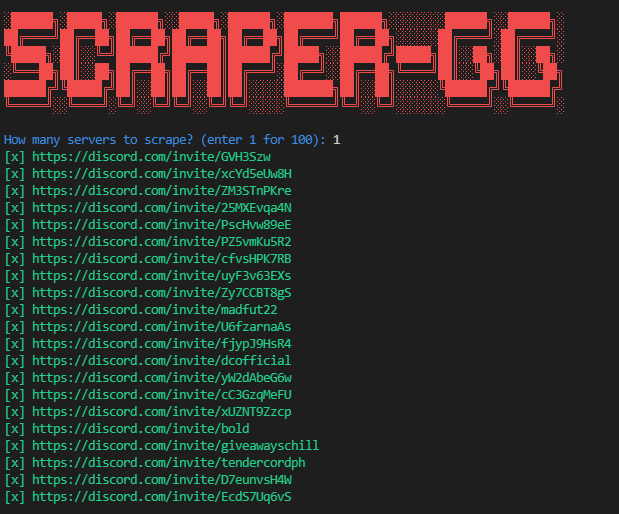

# bruh it got patched cuz new links protection sorry guys
> I'll try to fix

<h1 align="center">TopGG-Scraper</h1>
<p align="center">

</p>

<h4 align='center'>✉️ Easily store Discord invites from top.gg</h4>

## Preview



## Features

- Scrape invites from top.gg
- Store invites

## To do

- [ ] Merge project with my [checker](https://github.com/Mewzax/Checky-Free)

## Built with

- [httpx](https://www.python-httpx.org)
- [colorama](https://pypi.org/project/colorama/)

## Requirements

- [Python](https://www.python.org/downloads/)

## Installation

```t
# Clone the repo:
git clone https://github.com/Mewzax/TopGG-Scraper.git
cd TopGG-Scraper

# Install packages
pip install -r requirements.txt

# Run the code
python3 main.py
```

<p align="center"> 
    <b>Informations</b><br>
    
    
    
</p>
